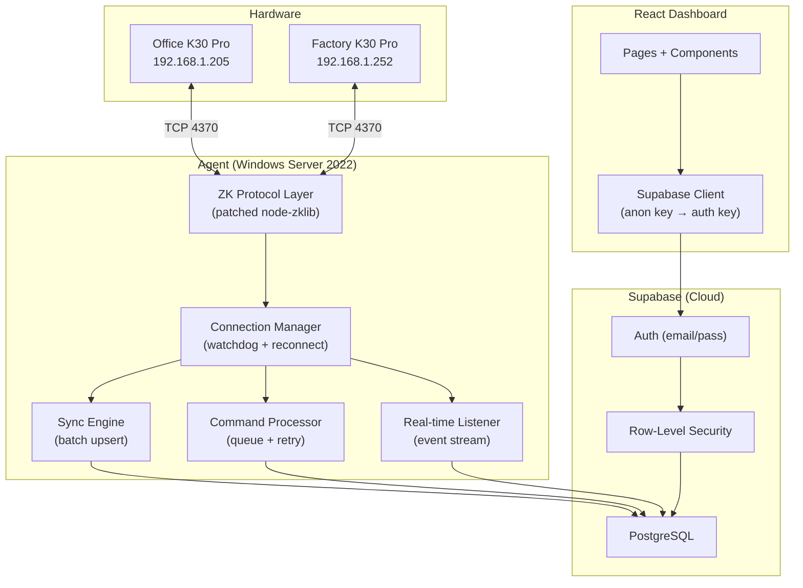
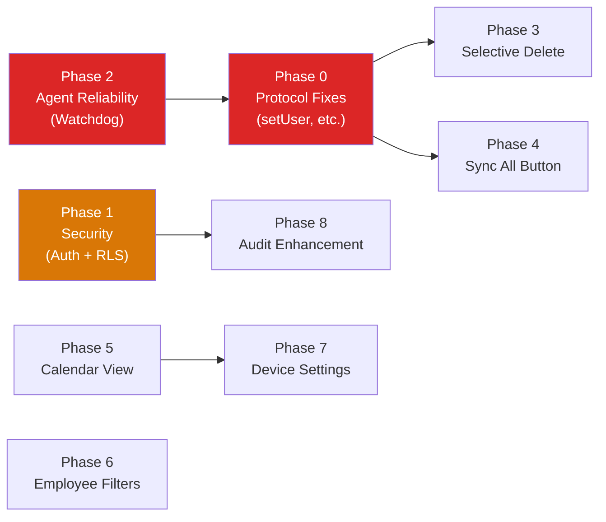

# AttendX — Hardened Implementation Plan v3

---

## Architecture Overview



---

## Phase 0: Protocol Bug Fixes (Critical)

### Problem
`node-zklib` is missing 4 critical write operations. The library only wraps read commands.

### Fix: Patch `zklibtcp.js` with Raw ZK Protocol

Each ZK command is a TCP packet:

```
[Header 8 bytes] [Command 2 bytes] [Session 2 bytes] [Reply# 2 bytes] [Data N bytes]
```

| Method | ZK Command | Packet Payload | Validation |
|--------|-----------|----------------|------------|
| `setUser(uid, name, password, role, cardno)` | `CMD_USER_WRQ` (8) | 72-byte struct: `uid(2) + role(1) + password(8) + name(24) + cardno(4) + group(2) + tz(2) + userId(9)` | Verify CMD_ACK_OK response, retry 2x on timeout |
| `deleteUser(uid)` | `CMD_DELETE_USER` (18) | 2-byte UID as little-endian UInt16 | Verify ACK, confirm user existed via getUsers first |
| `setTime(date)` | `CMD_SET_TIME` (=`CMD_OPTIONS_WRQ` 12 with key) | Encode as seconds since `2000-01-01 00:00:00` as UInt32LE | Validate date is within ±24h of now to prevent bad writes |
| `restart()` | `CMD_RESTART` (1004) | Empty payload | Mark device as disconnected immediately, reconnect after 30s |
| `powerOff()` | `CMD_POWEROFF` (1005) | Empty payload | Double-confirm before sending |

**Reliability safeguards:**
- Every write command will **disable the device first** (`CMD_DISABLEDEVICE`), perform the operation, then **re-enable** (`CMD_ENABLEDEVICE`) — this is required by the ZK protocol spec to prevent conflicts
- **3-second timeout** per command with 2 retries
- **Verify after write**: After `setUser`, call `getUsers` and confirm the user exists
- **Refresh data**: After any write, send `CMD_REFRESHDATA` (1013) to force device to reload

### Patch Persistence
- All changes go into `agent/patches/zklib-protocol-patch.js`
- Applied automatically via `npm postinstall`
- Patch file is version-controlled (not in `node_modules`)

---

## Phase 1: Security Hardening

### 1A. Supabase Authentication

| Layer | Current | Target |
|-------|---------|--------|
| Frontend API key | `anon` key (public) | `anon` key + Supabase Auth (email/password login) |
| Agent API key | `service_role` key | Same — runs on trusted server |
| RLS Policies | Open `anon` access | `anon` blocked, `authenticated` only |
| Dashboard | No login | Login page → JWT session → all API calls authenticated |

**Implementation:**
- Create admin user(s) in Supabase Auth dashboard
- Build a login page (email + password)
- Wrap all routes in `<AuthGuard>` component
- Store JWT in memory (not localStorage — XSS risk)
- Auto-refresh token before expiry
- Remove all `anon` write policies (003 migration will be replaced)

### 1B. Input Sanitization

| Input | Risk | Mitigation |
|-------|------|------------|
| Employee name | XSS injection in dashboard | Strip HTML tags, limit to 50 chars alphanumeric + spaces |
| Enroll number | SQL injection (unlikely with Supabase) | Validate integer, range 1-99999 |
| Command payload | Arbitrary data sent to device | Whitelist allowed command types, validate payload schema |
| Search fields | ReDoS | Escape regex characters, limit to 100 chars |
| Date filters | Invalid dates | Validate ISO format, reject future dates > today+1 |

### 1C. API Security

- **CORS**: Restrict to `localhost:5174` in dev, production domain in prod
- **Rate limiting**: Max 10 device commands per minute per user (prevent spam)
- **Audit trail**: Every destructive action (delete user, clear logs) logged in `audit_log` with user email + timestamp + before/after values

---

## Phase 2: Agent Reliability

### 2A. Connection Watchdog

```
Current: Reconnect check every 2 minutes (cron)
Target:  Exponential backoff reconnect with health monitoring
```

**Logic:**
1. On disconnect → attempt reconnect after 5s
2. If fail → retry after 15s, 30s, 60s, 120s (cap at 2 min)
3. On success → reset backoff counter
4. Log every reconnect attempt to `sync_history`
5. If disconnected for >10 minutes → mark device as `error` in DB
6. Real-time listener auto-restart after reconnect (with `activeListeners` tracking)

### 2B. Command Processor Hardening

```
Current: Poll every 10s, execute immediately, no retry
Target:  Robust queue with retry, timeout, and dead-letter handling
```

| Feature | Implementation |
|---------|---------------|
| **Retry** | Failed commands retry 2x with 10s delay |
| **Timeout** | Commands older than 5 minutes auto-marked as `expired` |
| **Dead letter** | After 3 failures, mark as `failed_permanent`, notify dashboard |
| **Concurrency** | Process 1 command at a time per device (prevent race conditions) |
| **Idempotency** | Before `add_user`, check if user already exists on device |

### 2C. Data Integrity

**Sync engine safeguards:**
- **Unique constraints** on `(enroll_number, punch_time, device_id)` in `raw_punches` — already exists
- **Unique constraint** on `(device_id, enroll_number)` in `device_users` — already exists
- **Transaction batching**: Upsert punches in batches of 50 (not 100) to reduce timeout risk
- **Checksum validation**: After sync, compare record count in DB vs device
- **Stale data protection**: Don't overwrite employee name/dept if manually edited in dashboard (add `manual_override` flag)

### 2D. Windows Service Resilience

- Install as Windows Service using `node-windows`
- **Auto-restart on crash**: Service recovery set to restart after 5s
- **Startup type**: Automatic (Delayed Start)
- Log to Windows Event Log + file (`agent/logs/agent.log`)
- **Health endpoint**: Agent exposes a simple HTTP health check on port 3377 (optional)

---

## Phase 3: Feature — Selective Log Deletion

### Design
- The K30 Pro only supports `CMD_CLEAR_ATTLOG` (wipe all). **No selective device deletion**.
- Therefore: selective deletion = **Supabase DB only**

### Workflow
1. Attendance page shows checkbox on each row
2. Select 1+ rows → "Delete Selected" button appears in header
3. Click → **Confirmation modal**: "Permanently delete X records from database? This cannot be undone. Device logs are not affected."
4. On confirm → soft-delete: set `deleted_at = NOW()` column (not hard delete)
5. Deleted records hidden from dashboard views
6. **Undo window**: 30-second toast with "Undo" button after deletion
7. Admin can view deleted records in Audit Log

**Migration:**
```sql
ALTER TABLE raw_punches ADD COLUMN deleted_at TIMESTAMPTZ DEFAULT NULL;
CREATE INDEX idx_raw_punches_active ON raw_punches(punch_time) WHERE deleted_at IS NULL;
```

All existing queries updated to add `WHERE deleted_at IS NULL`.

---

## Phase 4: Feature — Dashboard Sync All

### Design
- New button: **"Sync All Devices"** (next to Refresh)
- Sends `sync_attendance` + `sync_users` to every active device
- Shows inline progress: "Queued 4 commands..." → polls status every 2s
- Auto-refreshes dashboard after all commands complete (or after 15s timeout)
- **Debounced**: Disabled for 30s after click to prevent spam

---

## Phase 5: Feature — Calendar Attendance View

### Computation Engine

For each employee × each day in the selected month:

```
INPUT:  raw_punches WHERE employee = X AND date = D
OUTPUT: status = P | L | A | HD | H | W | — (no data)

LOGIC:
1. If date is in `holidays` table → H
2. If date is Saturday or Sunday → W
3. If no punches exist → A (Absent)
4. first_punch = MIN(punch_time) for that day
5. last_punch = MAX(punch_time) for that day
6. Get shift_start from: employee.shift_start → device.shift_start → attendance_rules.shift_start (fallback chain)
7. grace = device.grace_period_mins → attendance_rules.grace_period_mins
8. If first_punch > shift_start + grace → L (Late)
9. total_hours = last_punch - first_punch
10. If total_hours < half_day_threshold → HD (Half Day)
11. Else → P (Present)
```

### UI: Frozen Grid

```
┌─────────────┬────┬────┬────┬────┬────┬─ ─ ─┬────┬─────┐
│ Employee    │  1 │  2 │  3 │  4 │  5 │     │ 30 │ TTL │  ← frozen row
├─────────────┼────┼────┼────┼────┼────┼─ ─ ─┼────┼─────┤
│ Aditya      │ P  │ P  │ L  │ A  │ H  │     │ P  │ 22P │  ← scrollable
│ Rahul       │ P  │ A  │ P  │ P  │ H  │     │ P  │ 20P │
│ Priya       │ P  │ P  │ P  │ HD │ H  │     │ A  │ 19P │
├─────────────┼────┼────┼────┼────┼────┼─ ─ ─┼────┼─────┤
│ TOTAL       │ 3  │ 2  │ 3  │ 2  │ 0  │     │ 2  │     │  ← frozen row
└─────────────┴────┴────┴────┴────┴────┴─ ─ ─┴────┴─────┘
  ↑ frozen col
```

**Implementation:**
- CSS `position: sticky` for frozen columns and rows
- `left: 0` + `z-index: 2` for name column
- `top: 0` + `z-index: 2` for date header row
- Corner cell (top-left) gets `z-index: 3`
- Cell colors: P=green, L=amber, A=red, H=blue, HD=orange, W=gray
- **Click cell** → popup with all punches for that employee on that day
- **Export**: Download as CSV or Excel with the same grid format
- **Month picker**: `< June 2026 >` with arrows

### Data Loading Strategy
- Fetch ALL raw_punches for the selected month in one query
- Fetch ALL employees, holidays, device settings
- Compute the entire grid client-side (fast, no N+1 queries)
- Cache in `useMemo` — only recompute on month/filter change

---

## Phase 6: Feature — Employee Filters

### Filter Bar
```
┌─────────────────────────────────────────────────────────────┐
│ [Search...     ] [Dept ▼] [Status ▼] [Device ▼] [Clear ×]  │
└─────────────────────────────────────────────────────────────┘
```

| Filter | Type | Values |
|--------|------|--------|
| Search | Text input | Name, enroll #, phone |
| Department | Dropdown | Auto-populated from unique `employees.department` values |
| Status | Toggle pills | Active / Inactive / All |
| Device | Dropdown | "Office" / "Factory" / "Not assigned" (join with `device_users`) |

- Filters are **composable** (AND logic)
- URL-persisted via query params (`?dept=Engineering&status=active`)
- Show count: "Showing 12 of 45 employees"
- Animate list changes with `AnimatePresence`

---

## Phase 7: Feature — Per-Device Shift Settings

### Data Model

**Migration:**
```sql
ALTER TABLE devices
  ADD COLUMN shift_start TIME DEFAULT '09:00:00',
  ADD COLUMN shift_end TIME DEFAULT '18:00:00',
  ADD COLUMN grace_period_mins INTEGER DEFAULT 15,
  ADD COLUMN half_day_threshold_hrs NUMERIC(3,1) DEFAULT 4.5,
  ADD COLUMN overtime_trigger_mins INTEGER DEFAULT 30;
```

### Settings Page Layout
```
┌─ Global Defaults ──────────────────────────────────────────┐
│  Company Name: [________]   Weekend: [Sat-Sun ▼]           │
│  These apply when no device-specific settings exist.       │
│  Shift: [09:00]-[18:00]  Grace: [15] min  OT: [30] min    │
└────────────────────────────────────────────────────────────┘

┌─ Office (192.168.1.205) ─────────────────────────────────┐
│  ☑ Use custom settings (uncheck = inherit global)         │
│  Shift: [09:00]-[18:00]  Grace: [15] min                  │
└───────────────────────────────────────────────────────────┘

┌─ Factory (192.168.1.252) ────────────────────────────────┐
│  ☑ Use custom settings                                    │
│  Shift: [07:00]-[16:00]  Grace: [10] min                  │
└───────────────────────────────────────────────────────────┘
```

### Inheritance Chain
```
Employee-level shift → Device-level shift → Global shift
(highest priority)      (medium)             (fallback)
```

---

## Phase 8: Audit & Monitoring

### Audit Log Enhancement

Every write operation logged with:
```json
{
  "action": "delete_punch",
  "user_email": "admin@company.com",
  "entity_type": "raw_punches",
  "entity_id": 1234,
  "old_value": { "enroll_number": 102, "punch_time": "..." },
  "new_value": null,
  "ip_address": "192.168.1.100",
  "created_at": "2026-06-18T18:00:00Z"
}
```

### Agent Monitoring
- Heartbeat includes: CPU usage, memory, uptime, last error
- Dashboard sidebar shows: agent version, uptime, connected devices count
- If agent goes offline for >5 min: show red banner at top of dashboard

---

## Implementation Order



**Recommended order:**
1. **Phase 0** — Protocol fixes (unblocks everything)
2. **Phase 2** — Agent reliability (prevents data loss)
3. **Phase 7** — Per-device settings (needed for calendar computation)
4. **Phase 5** — Calendar attendance view
5. **Phase 6** — Employee filters
6. **Phase 3** — Selective log deletion
7. **Phase 4** — Sync all button
8. **Phase 1** — Auth (can be added last, protects production)
9. **Phase 8** — Audit enhancement

---

## Risk Matrix

| Risk | Impact | Likelihood | Mitigation |
|------|--------|-----------|------------|
| ZK protocol packet format wrong | Device crash / data corruption | Medium | Test on Office first, verify with getUsers after every setUser. Keep Factory as fallback. |
| Agent crash during bulk sync | Lost connection, missed punches | Low | Real-time listener catches live punches. Service auto-restarts. |
| Supabase rate limit hit | Sync failures | Low | Batch upserts, 50 records/batch, 500ms delay between batches |
| Wrong shift settings = false late marks | Incorrect attendance reports | Medium | Show computed values on calendar, allow manual override per cell |
| Auth lockout | Admin can't access dashboard | Low | Keep a recovery endpoint, or direct Supabase dashboard access |

---

## Questions Before I Start

1. **Auth now or later?** Adding login now means more upfront work but secures everything. Adding later is faster but dashboard stays open. Recommendation: add last, before production deployment.

2. **Calendar cell click** → Should it show a **popup** with punch details, or a **side panel**? Popup is simpler, side panel is richer.

3. **Soft-delete or hard-delete** for attendance records? Soft-delete (recommended) keeps an audit trail and allows undo. Hard-delete is permanent.

4. **Should I test protocol fixes on Office machine first** before touching Factory? (Recommended: yes, Office as primary test device)

5. **Any additional features** you want included before I start coding?
